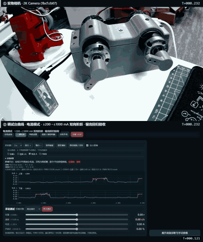
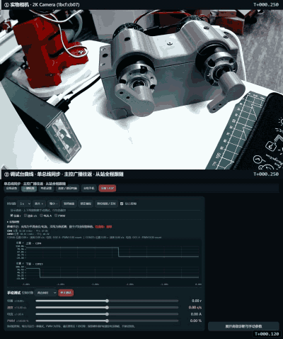
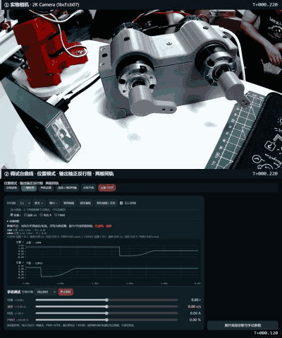
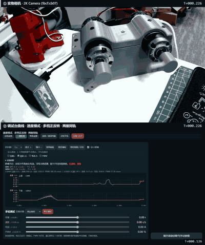
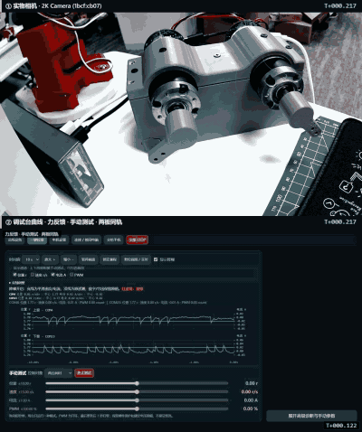
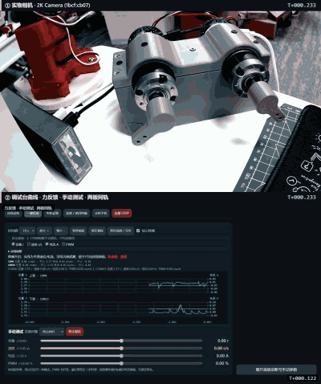
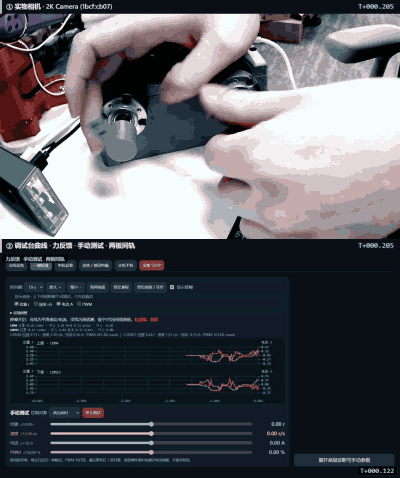

# 双 ESP32-S3 电机控制与双向力反馈

两块相同驱动板、一套固件，通过单线 DATA 总线交换位置与电流，在本机网页进行双向力反馈和位置/速度/电流调试。

**7 段实测视频全部通过** ·
[在线视频验收页](https://cdh66666.github.io/dual-esp32-motor-force-feedback/video-acceptance.html)（可展开判据、阈值与每条指令的发出时刻）·
[视频素材目录](docs/videos)

---

## 一、实测视频 · 打开即自动循环

每段视频都由**同一台电脑、同一个进程**同时抓两路并当场合成的：上半是实物相机，下半是调试台页面（100 Hz 遥测曲线）。画面里两半都烧了**同一个时钟**，暂停在任意一帧都能直接对上「曲线发生了什么 / 电机在做什么」。

原片是 1280×1528 / 15 fps，7 段合计约 75 MB，不适合放在仓库里长期托管。下面是把同样的内容压到 5 fps / 400 px / 32 色后的循环预览，**7 段合计 7.4 MB**（时域降噪 + 盒式缩放 + 粗抖动，见[压缩方式](docs/videos)）。逐条判据在[完整验收页](https://cdh66666.github.io/dual-esp32-motor-force-feedback/video-acceptance.html)。

<table>
  <tr>
    <td><br><b>01 电流模式 · ±200→±1000 mA 双向阶跃 · 锯齿回归</b></td>
    <td><br><b>02 单总线同步 · 主控广播往返 · 从站全程跟随</b></td>
  </tr>
  <tr>
    <td><br><b>03 位置模式 · 输出轴正反行程 · 两板同轨</b></td>
    <td><br><b>04 速度模式 · 多档正反转 · 两板同轨</b></td>
  </tr>
  <tr>
    <td><br><b>05 双向力反馈 · 手动测试 1</b></td>
    <td><br><b>06 双向力反馈 · 手动测试 2</b></td>
  </tr>
  <tr>
    <td><br><b>07 双向力反馈 · 手动测试 3（最终录制链路）</b></td>
    <td></td>
  </tr>
</table>

## 二、核心实测数据

采集相机 `2K Camera (1bcf:cb07)`，录制时两板均 `2 / 2 台在线 · 待机`，全程 15 fps 采集。

| # | 用例 | 帧数 / 时长 | 实际帧率 | 关键实测 | 结论 |
| --- | --- | --- | --- | --- | --- |
| 01 | 电流模式 ±200→±1000 mA 双向阶跃 | 317 / 20.95 s | 15.08 fps | 参考电流 **σ 最差 0.0 mA**（阈值 5），32 个端口档位全是平顶、无锯齿；反向档实测电流 −191…−393 mA、轴速 **−37 996…−48 315 °/s**；换向前先收到 0 mA，**换向瞬间轴速 0 °/s** | ✅ |
| 02 | 单总线同步 · 主从广播往返 | 216 / 14.29 s | 15.05 fps | 从站**全程位移 538.2°** 输出轴（阈值 ≥ 1°，证明不是只跟一次）；主/从行程 533.9° / 538.2°，**差 4.4°**（阈值 15°）；5 个广播点的同刻角差 **0.30–3.15°**（阈值 6°） | ✅ |
| 03 | 位置模式 · 输出轴正反行程 | 186 / 12.22 s | 15.14 fps | 10 次到位，固件 `position_release` 误差 **−1.99…+1.87°** 输出轴，全部落在当时窗口 2.00° 内；再由 `status` 独立读回，与目标差 **0.06–2.00°**（阈值 2.5°） | ✅ |
| 04 | 速度模式 · 多档正反转 | 168 / 11.01 s | 15.17 fps | ±936 / 1872 / 3744 / 5616 °/s 共 12 档，指令与实测轴速**均值偏差 0.1–21.0%**（阈值 25%）；0 档实测 −5 / +2 °/s | ✅ |
| 05 | 双向力反馈 · 手动测试 1 | 186 / 12.21 s | 15.15 fps | 两板各记录 `forceArmed=1`，录像期间真实启用过力反馈 | ✅ |
| 06 | 双向力反馈 · 手动测试 2 | 246 / 16.21 s | 15.11 fps | 同上 | ✅ |
| 07 | 双向力反馈 · 手动测试 3 | 247 / 16.28 s | 15.11 fps | 同上；走的是修好收尾路径的最终链路，编码段实测 **2.69 s** | ✅ |

减速比 5.2 : 1，网页位置统一为输出轴圈数 `r`。

### 双源同轨录像链路本身的数据

| 环节 | 实测 |
| --- | --- |
| 采集帧率 | 15 fps（7 段实测 15.08–15.17 fps，无掉帧） |
| 单帧开销 | 合成约 19 ms/帧；改为浏览器主动推送画面后，省掉原先逐帧同步截屏的约 74 ms/帧 |
| 编码 | libvpx `-deadline realtime -cpu-used 5`，同源同码率由 10.6 s 降到 2.0 s（**5.3×**），产物大小与抽帧画质无可见差异 |
| 还相机 | `ctx.close()` 实测 **15–18 ms** 即释放相机；`browser.close()` 放后台跑，录制结束到开始编码的空档由约 5 s 压到 1.5 s |
| 录制中预览 | 相机被录制进程独占，页面把**进 clip 的同一帧**以 MJPEG 回灌到预览位（上限约 9 fps），操作者全程看得到实物画面 |
| 收尾可靠性 | 删中间帧交给独立子进程；`done` 一发布即派进程外守门者，30 s 后仍存活就整棵进程树回收 |

## 三、功能速览

| 能力 | 说明 |
| --- | --- |
| 双向力反馈 | 转动一端、另一端跟随；两板可独立启用，也可双板同轨 |
| 三环与遥测 | 电流环 2 kHz、速度环 500 Hz、位置环 200 Hz；遥测 100 Hz（取自 `firmware/src/main.cpp` 的 `*_LOOP_PERIOD_US` 与 `streamRateHz`）。目标频率不是所有工况下的实时性保证 |
| 四种运行模式 | 位置 / 速度 / 电流 / 开环 PWM，滑条实时更新，不积压旧目标 |
| 板间总线 | 单线 DATA，地址化协议 + CRC16；一方主控广播、另一方跟随 |
| 单入口控制 | 只留任意一根健康 USB 也能控制两板；身份 META 按会话缓存 5 s，位置滑条每 500 ms 续租，遥测过期即 STOP |
| 交互保护 | 实测持续超限 5 s 锁定过流故障、降至限值以下即清零；实测绝对电流达 5 A 立即保护；驱动故障与供电异常各有独立保护 |
| 力反馈速度降额 | 输出轴 10 r/s 开始减力，12 r/s 滑行；单轮 60 秒正常结束 |
| 调试台 | 本机网页：双板同屏 100 Hz 曲线、历史缩放、通道叠加、一键 STOP、**「录制 15 秒」**按钮 |
| 工具链 | 身份校验烧录、离线回归、只读单 USB 总线核验、实机阶跃验证 |

## 四、硬件与坐标

| 项目 | 当前装置 |
| --- | --- |
| 控制器 / 驱动 | 两块 ESP32-S3 / SS6952T 驱动板 |
| 电机 | 两台 36GP-555，24 V 档案 |
| 实际供电 | 20 V / 3 A，共用电源 |
| 减速比 | 电机轴 : 输出轴 = 5.2 : 1，可配置 |
| 传感器 | 后轴 MT6701 磁编码器、INA240A1 支路电流采样 |
| 板间总线 | 单线 DATA，地址化协议、CRC16；两板共地 |

网页位置统一为输出轴圈数 `r`，速度为 `r/s`，电流为 `A`。固件内部使用电机轴角度/角速度；输出轴位置由后轴除以减速比推算，不包含独立测量的齿隙或弹性变形。

两板使用同一固件，每块板分别保存方向、采样极性、DATA 地址和配置。**不要按旧 COM 号认板，也不要直接复制另一块板的方向设置。** 网页动态枚举端口，以 USB 序列号识别换口后的设备。连接恢复、刷新和复位不自动恢复旧运动目标。

## 五、快速启动

Windows 11，安装 Git、Python 3（本机验证为 3.13）及 PowerShell 7：

```powershell
git clone https://github.com/cdh66666/dual-esp32-motor-force-feedback.git
cd dual-esp32-motor-force-feedback
python tools/launch_dashboard.py
```

启动器安装串口依赖，启动本机服务并打开 [调试台](http://127.0.0.1:8766/)。也可手动启动：

```powershell
python -m pip install -r requirements.txt
python web/server.py
```

服务默认仅监听 `127.0.0.1`。控制 API 无多用户认证，不应直接暴露到公网。其他电脑需要重新确认身份、接线和板端参数，网页能打开不代表可以驱动电机。

## 六、网页使用

1. 接入两板 USB，等待有效遥测。只有端口存在、没有新鲜遥测，不算连接正常。
2. 在悬浮“电机设置”中核对额定电压、最大电流、减速比；保存会先停止运动。
3. 上下两窗分别显示两板，共用通道选择，默认位置和电流。实线为实测，**红色虚线为目标**；支持缩放、历史查看及独立纵轴。
4. 三个滑条直接控制位置、速度或电流，可选一台或两台；同一台每次只运行一种模式。范围为 ±10 r、±15 r/s、±1 A。拖动实时更新，不积压旧目标。
5. 双向力反馈需显式启动，转动一端、另一端跟随；图表持续更新。停止使用“停止力反馈”或“全部 STOP”。
6. 想做第 1 节的这种两源录像时，点面板上的**「录制 15 秒」**：录制端不下发任何运动指令，只做记录；录制期间预览位会自动切到录制进程的实时画面，编码阶段相机会自动还回本机预览。

显示保留两位小数，原始采样和计算不因此舍入。“基本检查”仅检查方向及基本响应，不承诺自动获得最优三环参数。历史整定脚本不是日常入口。

## 七、当前控制行为

| 参数 / 机制 | 当前行为 |
| --- | --- |
| 电机配置最大电流 | 两板本次均为 1.50 A，不等于电机连续额定电流认证 |
| 工作电流目标 | 配置值的 80%，本次 1.20 A；手动电流滑条仍为 ±1 A |
| 位置 / 速度外环 | 默认电流额度对齐 80%；移除未验证 R/Ke 模型造成的电压权限限制 |
| 位置速度上限 | 输出轴 15 r/s；5.2 减速比时板端 28080 °/s，短行程不一定达到 |
| 正常电流调节 | PI 连续调节、积分防饱和；不因普通电流限幅执行卸力后恢复斜坡 |
| 力反馈模型电压边界 | 保留用户验收路径；模型有误差，不是硬件限流保证 |

力反馈/直接电流的交互保护：实测持续达到或超过配置电流上限 5 秒才锁定过流故障，降至限值以下即清零计时；实测绝对值达到 5 A 仍立即保护。5 A 边界依据用户报告的板级实测，不是对所有板子、电机或接线的认证。驱动故障、供电异常、反馈失效等独立保护仍保留；单电机旋钮另有自己的限制。

力反馈速度机制仍有效：输出轴 10 r/s 开始减力，12 r/s 滑行；单轮 60 秒正常结束。“持续显示”不是无限时高负载许可。不能保证任意快速扭动都不会过流，也没有独立的电机温升测量。

## 八、编译与烧录

PlatformIO，Espressif32 6.4.0 / Arduino 2.0.11，默认环境 `esp32-s3-devkitc-1`，TinyUSB CDC。

```powershell
python -m pip install -r requirements-commissioning.txt
python -m platformio run -d firmware -e esp32-s3-devkitc-1
python -m serial.tools.list_ports -v
```

对已响应的应用使用身份校验流程，将占位符替换为实时枚举值：

```powershell
# 只核对身份
python tools/reflash_board.py --port COMx --serial USB_SERIAL
# 默认要求电机电源断开，仍保留 USB 通信
python tools/reflash_board.py --port COMx --serial USB_SERIAL --flash
```

脚本编译、核对身份、确认 STOP/休眠回执、进入 ROM、烧录校验、重连并保持停止，不擦除 NVS；OTA 固件同时写入 app0/app1，避免旧 `otadata` 选择另一空槽导致复位后停在 ROM。原生 USB 若未连接 DTR/RTS，写入校验完成后需松开 BOOT 并按一次 RST 才能退出下载模式。`--attached-guarded` 仅用于有隔离防护且明确授权的带电调试，须满足静止、PWM0、驱动休眠及电压检查；不是通用在线烧录安全认证。不要绕过失败的身份或回执检查。

## 九、检查与测试

安装 Node.js 后执行不连接硬件的核心回归：

```powershell
pwsh -NoProfile -File tools/check_offline.ps1
```

可选网页隔离测试使用 Playwright 与 Edge；`tests/offline_browser.cjs` 拦截设备 API，不操作实机。部分历史浏览器/C++脚本包含本机运行时或 VS Build Tools 路径，换电脑需调整，不能当成通用 CI。

上电后的只读单 USB 总线核验使用 `python tools/check_chain_gateway.py`；脚本自动选择当前健康 USB 入口、发现 DATA 对端并回读身份/停止状态，不按 COM 号写死，也不发送运动命令。远端板若曾触发板端功率路径锁存，可在链路面板选择“恢复远端保护”；该命令需要两板都运行包含 DATA `recover` 支持的同一固件，并且只在 STOP、供电和 nFAULT 检查通过后清锁存。

**下列命令会运动，须固定电机、松开手柄、确认无人接触：**

```powershell
# 当前夹具固定为 COM4/COM23 及对应序列号，先核对脚本 devices
node tools/verify_position_authority.cjs
# 仅补测指定板，结束仍会停止两板
node tools/verify_position_authority.cjs --port=COM23
```

单根 USB、两板均松开后的可见中等输出轴阶跃（默认每板 +45°，脚本始终 STOP/休眠收尾）使用：

```powershell
node tools/verify_single_usb_pair_step.cjs
```

该脚本只用于一次短时响应排查，不替代位置、速度或力反馈验收；DATA 对端若返回 `NACK rejected=...`，应先恢复/检查板端保护，不得把网页回执当作运动成功。

此测试只验证短时可见阶跃往返，不验证 15 r/s。其他 `live`、`powered`、`flash`、`sweep` 脚本可能运动或烧录，**不要批量运行 tests/ 或 tools/**。

## 十、常见问题

- **换口后失联：** 检查系统枚举、USB 身份、有效遥测。端口已打开但写超时不等于连接成功；显式连接恢复仍失败时拔插目标板 USB。恢复后不会自动继续运动。
- **位置仍慢：** 用 `cascade status` 核对 `max_velocity`、`max_current`，比较目标与实测速度/电流。不要仅提高速度上限或套用未辨识的模型。
- **力反馈报警：** 按具体原因处理并保留 `evidence/fault-captures/`；警告、正常结束、严重故障是不同状态。
- **周期性 USB 失联：** 已复现过只收不发，尚未证明长期根因消除；一次恢复不等于永久修复。
- **USB 自动重连退避：** 连续失败从 1 秒指数退避至最长 60 秒，避免坏端点反复打开造成错误风暴；手动点击“连接”会立即重试，成功或新会话自动清零。

## 十一、代码与资料导航

- `firmware/src/main.cpp`：控制循环、状态机、总线、命令处理。
- `firmware/include/`：控制数学、交互保护、旋钮、USB 策略。
- `web/`：Python 串口服务、实时滑条、示波器及力反馈界面；`web/recorder.py` 是「录制 15 秒」按钮的后端。
- `tools/`：启动、身份烧录、离线检查与实机验证。
- `tests/`：离线契约、模拟串口、控制数学及历史实机测试。
- `docs/`：硬件、协议、逐轮记录；早期结论不覆盖当前 README。
- `docs/videos/`：第一节那 7 段循环预览 GIF。
- `docs/video-acceptance.html`：完整视频验收页（判据表、阈值、命令时间轨），也是 [Pages 上那一份](https://cdh66666.github.io/dual-esp32-motor-force-feedback/video-acceptance.html)。
- `evidence/`：少量发布证据；原始长采样、故障快照、构建产物留在本机。历史分析脚本可能依赖未发布数据。

## 十二、手动 PWM 测试

手动测试新增 ±100% PWM 滑条（映射到有符号 ±4095），可选择单板或双板。
不经过三环控制，也不改写三环参数；进入 PWM 测试时补选 PWM 曲线，保留已有通道；同模式拖动不覆盖手动勾选。
复用板端 `cw/ccw` 指令：每次更新有效 1 秒，拖动更新，停止更新后到期归零；零值发送 STOP。
保留驱动硬件保护和额定电压限幅，因此请求占空比不一定等于实际占空比；开环不保证软件恒流。
新增功能经模拟通信和网页检查，未代替实机运动验收。

---

<details>
<summary><b>附：进度与历史档案（按日期，逐轮记录见 docs/）</b></summary>

### 当前状态 · 2026-09-17

当前源码版本为 `0.5.10-single-usb-force`；本机离线构建镜像 SHA256 为 `5e174d94d97db295e6374b83ad7bc26c91ade137674ed10d98b9757a66c5e3e3`。已知上一轮实际写入两板的候选镜像为 `2beb4dca24d34b7e3164bb61efb8d3768c89c5b550ceb383e1bb903054b8cf26`，两板 app0/app1 分段校验通过，但最后记录仍停在 ROM 下载枚举，尚未回到应用态读取新版本并做运动验收。当前源码构建与已刷写镜像不要混称。

核心 8 项验收按“当前代码 + 当前版本硬件证据 + 安全/边界证据”综合约 **70/100**；这不是代码行覆盖率。完整评分、证据和未完成项见 [当前进度评估](docs/progress-20260917.md)。免密码热点允许附近人员连接，请仅在受控场地使用。

#### 2026-09-16 收尾状态

- 两根 USB 同时连接时，页面显示两个真实 USB 板卡，不重复生成 DATA 卡片；只保留任意一根健康 USB 时，页面自动显示另一块为 `DATA-1` 或 `DATA-184`，并沿用同一套位置/速度/电流/PWM 调试视图。
- 修复了维护或掉线的物理端口遮蔽 DATA 对端的问题；该端口只有在新鲜、非维护会话下才参与去重。单 USB 双向只读网页回归已通过；本轮重新刷写后尚待 RST 恢复应用，再做新鲜单入口验证。
- 最新候选已经写入两板 app0/app1 并通过哈希校验；应用暂以 ROM 下载设备枚举。烧录前状态回读为 `control=idle`、`awake=0`、`pwm=0`、`nFAULT=1`；目前不能声称新固件处于应用待机，也不宣称实机运动、带载、长期温升或力反馈性能验收。热点功能按用户要求最后处理。
- 修正 36GP-555 位置最大速度前后轴换算：板端与网页统一为输出轴 15 r/s 测试上限（28,080 motor deg/s）。候选将位置轨迹加速度/jerk 配置为 40,000 motor deg/s²、300,000 motor deg/s³；这是参考轨迹包络，不代表电机在当前 20 V/65 W 供电下实际达到 15 r/s，须恢复应用后做有界实测。
- 运动反馈做了真实控制侧降抖：低速编码器微分使用 5 ms 窗口并混合增量中值，高速保留原始增量以减少相位滞后；电流目标接近零且实测仅为噪声时直接滑行，避免 2 kHz PI 在零点反复换向。曲线显示仍保留原始遥测，不用显示滤波冒充控制改善。
- 单 USB DATA 控制减少重复事务：身份 META 按 USB 会话/STOP 纪元缓存 5 s，远端唤醒提示缓存 10 s；每次控制仍校验 UID、范围、会话和回执，拒绝后不盲目重试并清除唤醒提示。位置滑条命令每 500 ms 续租，仅在遥测新鲜时进行；遥测过期则 STOP，板端 1 s 失联租约保留。PWM 不自动续租，其他模式遵循所选持续时间。远端状态轮询在滑条命令排队/发送时让路，降低 1 Mbaud 总线上的命令等待。

本轮调整与验证证据见 [运动平顺性与单 USB 性能记录](docs/motion-smoothness-20260916.md)。离线回归通过不等于运动性能验收。

### 全范围重定目标检查 · 最新进展

电流失跟的最新审查与修正见 [电流电压权限分析](docs/current-authority-analysis-20260914.md)：修正未经验证的 R/Ke 模型阻挡电流 PI 调压，平滑反电动势前馈而非继续加重电流反馈滤波；保留实测保护。静止部署与离线验证不代表新内环已经完成运动验收。

较早的供电适配档案见 [现有供电适配及采样修正](docs/supply-current-sampling-20260914.md)。其中 8 r/s 是当时保守默认值；本次 2026-09-16 候选已按用户要求把网页/固件位置参考上限设为输出轴 15 r/s，并将轨迹加速度/jerk 设为 40,000 motor deg/s²、300,000 motor deg/s³。它们是指令参考边界，不代表新固件已实测达到该转速；运行验收待应用恢复后完成。

±10 圈测试及位置制动参考修正见 [全范围检查记录](docs/full-range-retarget-20260914.md)。COM4 已完成的长行程超调显著下降，但连续换向出现共享供电中断，用户说明可调电源关机后重新开启，根因待查。两板修正已烧录，COM23 全范围运动尚未验收。USB 网关与板端手机热点工程版已部署，双向 DATA 身份/状态查询通过；单根 USB 拔线验收和手机无线控制尚未完成，见 [网关部署记录](docs/gateway-rollout.md)。不要把较早的小角度通过记录当作全工况验收。

### 双板独立调教与曲线跟随 · 2026-09-14

**磁铁重装后的最新取向：响应优先、到位不持续摆动，不再承诺严格零超调。** 当前配置与新鲜实测见 [重装磁铁后调试记录](docs/magnet-remount-20260914.md)，优先于下方较早的独立调教记录。

按用户最新决定，两板独立调教，不强求共用。当前参数及验证结果见 [独立调教记录](docs/independent-tuning-20260914.md)。两板均已部署参数保存功能，方向、采样极性及力反馈参数保留各自配置。
曲线默认只显示位置，操作手动位置/速度/电流滑条时，上下两窗切换到相应通道；仍可手动勾选叠加。

### COM23 位置抖动修复记录 · 2026-09-14（下文为本日较早阶段）

COM23（USB 序列号 `68EE8F52A79C`）小幅定位曾在到达目标后出现持续往返振荡。
已实测降低该板外环增益并保存到板内：速度 PI `0.0004 / 0.008`，位置 PID `12 / 0 / 0.05`（固件电机轴单位）。
COM4 保留原参数，电流环、力反馈与保护逻辑未修改。COM23 已部署新固件并验证重启保留参数。
重启后四次 ±18° 小幅定位、每次保持 5 秒均通过，末 200 ms 平均绝对误差不超过 0.035°；不代表满速、负载或长期工况验收。

新增 `cascade save_outer`：仅在 STOP 且 sleep 后保存本板当前电机档案的五个外环增益，不保存运动目标、电流环或限流设置。
网页连接时读取板端配置。COM4 尚未烧录此持久化功能，其原固件继续运行。
新镜像与完整记录见 [COM23 调试记录](docs/com23-position-20260914.md)。

### 历史基线验收 · 2026-09-09（不是当前候选的重新验收）

- **0.5.9 基线的双向力反馈：用户实测验收通过。** 后续 0.5.10 候选修改了控制侧速度估计、零电流处理、位置轨迹和单 USB 路由，因此必须重新做当前版本实机验收。
- **两板小幅位置测试通过：** 逐台执行输出轴 `+18° → 0° → −18° → 0°`。COM4 进入 ±0.5° 范围约 0.35–0.54 秒，COM23 约 0.30–0.63 秒；采样峰值电流分别为 0.522 A、0.773 A。
- **未验收：** 实际达到输出轴 15 r/s、长期温升、任意外力工况和 USB 长时间稳定性。COM23 曾发生只收不发的写超时，拔插 USB 后补测通过，不代表根因已消除。
- 三环目标频率：电流 2 kHz、速度 500 Hz、位置 200 Hz；目标频率不是所有工况下的实时性保证。

版本字符串仍为 `0.5.9-sync-trace`，不同迭代不能只靠该字符串区分。本次已烧录镜像 SHA256：

```text
B93C5BE73606784FEB432C89AC28B48C286900843FA4916E832C9FED10056D22
```

见 [验收记录](docs/position-authority-20260909.md) 与 [证据索引](evidence/README.md)。此 hash 对应本机验证构建，跨环境重建不保证字节一致。

本次整理把当前候选、历史验收和未完成的实机门槛分开；不把未验收算法标成通过。旧 README 保留于 [历史说明](docs/legacy-readme-20260905.md)。

</details>
